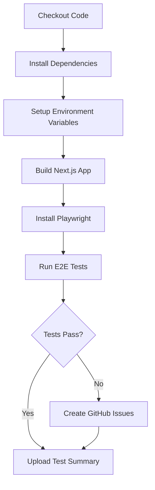

# E2E Testing Guide

## Quick Reference

### Running Tests

```bash
# Development (all browsers)
npm run test:e2e:ui          # Interactive UI mode (recommended)
npm run test:e2e:headed      # Watch tests run
npm run test:e2e             # Headless mode

# CI/Production
npm run build                # Build first
npm run test:e2e             # Run tests against production build
```

### Debugging Failed Tests

```bash
# View test report
npm run test:e2e:report

# Generate summary
npm run test:e2e:summary

# Create GitHub issues for failures (dry run)
npm run test:e2e:issues:dry

# Actually create issues
npm run test:e2e:issues
```

---

## CI/CD Pipeline Optimization

### Current Setup

The E2E test pipeline has been optimized to:

1. **Pre-build the app** before running tests
   - Uses production build (`npm run build`)
   - Faster startup time in CI
   - More realistic testing environment

2. **Use production server** during tests
   - `npm run start` instead of `npm run dev`
   - Reduces cold start time from 120s to 60s
   - Matches production environment

3. **Optimized timeouts** for CI
   - Action timeout: 15s (reduced from 30s)
   - Navigation timeout: 30s (reduced from 60s)
   - Test timeout: 60s (unchanged)
   - Overall job timeout: 60 minutes

4. **Better GitHub Issue creation**
   - Automatic gh CLI installation if missing
   - Proper authentication handling
   - Duplicate issue detection
   - Adds comments to existing issues

---

## Common Issues and Solutions

### Issue 1: Tests Timeout in CI

**Symptoms:**
- Tests pass locally but fail in CI
- Timeout errors after 60 seconds
- "Waiting for http://localhost:3000 failed"

**Solutions:**

1. **Ensure build completes first**
   ```yaml
   - name: Build Next.js app
     run: npm run build
   ```

2. **Use production server**
   ```yaml
   - name: Run Playwright tests
     run: npm run test:e2e
   ```

3. **Check Playwright config uses correct command**
   ```typescript
   webServer: process.env.CI
     ? { command: 'npm run start', ... }
     : { command: 'npm run dev', ... }
   ```

### Issue 2: No GitHub Issues Created

**Symptoms:**
- Tests fail in CI
- No issues appear in GitHub
- Issue creation step shows success but creates nothing

**Root Causes:**

1. **Missing test results file**
   - File: `tmp/test-results/results.json`
   - Generated by: `playwright test` with JSON reporter
   - Check: Workflow saves this file before issue creation

2. **gh CLI not authenticated**
   - Fixed in current workflow
   - Automatically installs and authenticates gh CLI
   - Uses `GITHUB_TOKEN` secret

3. **No failed tests**
   - Script only creates issues for failed/timeout tests
   - Check test results first

**Verification Steps:**

```bash
# 1. Check if results file exists
ls -la tmp/test-results/results.json

# 2. Check for failed tests
node scripts/create-test-issues.js --dry-run

# 3. Manually create issues
node scripts/create-test-issues.js
```

### Issue 3: Flaky Tests

**Symptoms:**
- Tests pass sometimes, fail other times
- Different results between runs
- Timeout on specific steps

**Solutions:**

1. **Add explicit waits**
   ```typescript
   // Wait for network to be idle
   await page.goto('/', { waitUntil: 'networkidle' });

   // Wait for specific element
   await page.waitForSelector('[data-testid="quiz-card"]');

   // Wait for state
   await expect(page.locator('.quiz-complete')).toBeVisible();
   ```

2. **Increase timeouts for slow operations**
   ```typescript
   test('slow operation', async ({ page }) => {
     test.setTimeout(90000); // 90 seconds for this test
     // ...
   });
   ```

3. **Use retry strategy**
   - CI automatically retries failed tests 2 times
   - Configure in `playwright.config.ts`:
     ```typescript
     retries: process.env.CI ? 2 : 0,
     ```

---

## GitHub Actions Workflow

### Build and Test Flow



### Environment Variables

Required in CI:

```env
NEXTAUTH_URL=http://localhost:3000
NEXTAUTH_SECRET=<auto-generated-in-ci>
AUTH_SECRET=<auto-generated-in-ci>
CI=true
```

### Artifacts Saved

1. **Test Summary** (`tmp/test-results/summary.md`)
   - Retention: 90 days
   - Contains: Pass/fail stats, duration, list of failures

2. **Playwright Report** (`playwright-report/`)
   - Retention: 30 days
   - Contains: Full HTML report with screenshots

3. **Test Traces** (`test-results/`)
   - Retention: 30 days
   - Only on failure
   - Contains: Video, screenshots, network logs

---

## Performance Benchmarks

### Expected Timings (CI)

| Stage | Duration | Notes |
|-------|----------|-------|
| Install dependencies | 20-30s | Cached |
| Build Next.js | 60-90s | First time |
| Install Playwright | 10-20s | Cached browsers |
| Start server | 5-10s | Production build |
| Run all tests | 2-5 minutes | 4 test files |
| **Total** | **4-7 minutes** | Full pipeline |

### Test File Breakdown

| Test File | Tests | Avg Duration |
|-----------|-------|--------------|
| navigation.spec.ts | ~8 tests | 30-60s |
| flashcard-flow.spec.ts | ~5 tests | 40-80s |
| quiz-flow.spec.ts | ~6 tests | 50-90s |
| progress-tracking.spec.ts | ~7 tests | 40-70s |

---

## Troubleshooting Checklist

When E2E tests fail in CI:

- [ ] Check if build step succeeded
- [ ] Verify environment variables are set
- [ ] Check server started successfully (look for "ready" in logs)
- [ ] Review test timeout settings
- [ ] Check if it's a known flaky test
- [ ] Look at screenshots/videos in artifacts
- [ ] Try reproducing locally with production build
- [ ] Check recent code changes that might affect tests

### Local Reproduction

To reproduce CI failures locally:

```bash
# 1. Build production version
npm run build

# 2. Set CI environment
export CI=true

# 3. Run tests
npm run test:e2e

# 4. Check results
npm run test:e2e:summary
```

---

## Issue Creation Details

### What Issues Get Created

The script creates issues for:
- ❌ **Failed tests** (`status: 'failed'`)
- ⏱️ **Timeout tests** (`status: 'timedOut'`)

### Issue Format

```markdown
## 🐛 E2E Test Failure

**Test:** Test name here
**Suite:** Suite > Subsuite
**Status:** ❌ Failed / ⏱️ Timeout
**File:** `e2e/test-file.spec.ts:42`
**Duration:** 65s

### Error
```
Error message and stack trace
```

### Context
- Retry Attempt: 2
- Failed At: 2024-12-18T12:34:56.789Z

### 🔍 Investigation Steps
- [ ] Reproduce the failure locally
- [ ] Check if it's a flaky test
...
```

### Duplicate Handling

- Script checks for existing open issues with same title
- If found: Adds comment to existing issue
- If not found: Creates new issue
- Labels: `e2e-test`, `bug`

---

## Future Improvements

### Planned Enhancements

1. **Parallel test execution** (currently disabled in CI)
   - Would reduce total time to 1-2 minutes
   - Need to ensure tests don't interfere

2. **Visual regression testing**
   - Screenshot comparison
   - Detect UI changes automatically

3. **Test sharding**
   - Split tests across multiple workers
   - Faster feedback on large test suites

4. **Better retry logic**
   - Exponential backoff
   - Retry only flaky tests

### Configuration Changes

To enable parallel execution:

```typescript
// playwright.config.ts
workers: process.env.CI ? 2 : undefined, // Change from 1
fullyParallel: true, // Already enabled
```

---

## Resources

- [Playwright Documentation](https://playwright.dev/)
- [GitHub CLI Documentation](https://cli.github.com/)
- [Next.js Testing](https://nextjs.org/docs/testing)
- [Project E2E README](./e2e/README.md)

---

**Last Updated:** 2024-12-18
**Maintained By:** Development Team
