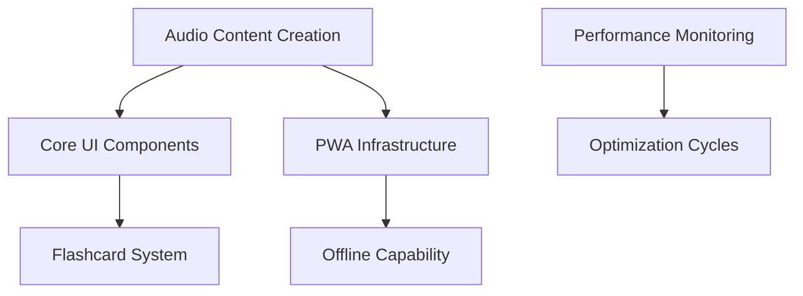
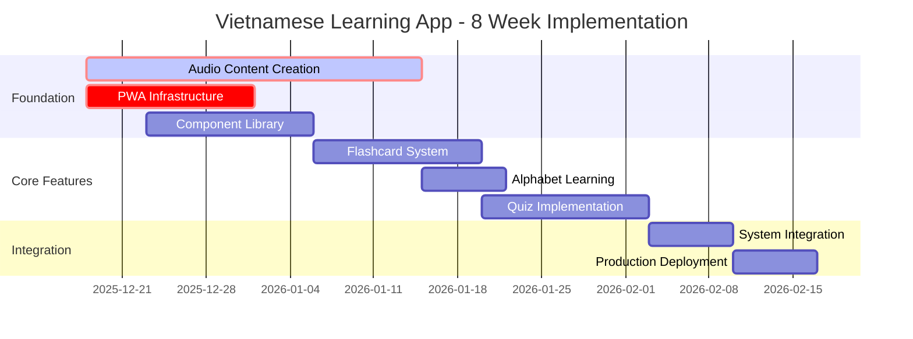

# Vietnamese Learning App - Task Decomposition Plan

**Document Version**: 1.0  
**Created**: 2025-12-18  
**Analysis Source**: Frontend Technical Analysis  
**Expert**: Task Decomposition Specialist

---

## Executive Summary

Based on the comprehensive frontend technical analysis, this task decomposition plan transforms the 8-week implementation strategy into actionable workflows with clear ownership, dependencies, and risk mitigation. The critical success factors are **audio content creation** (highest bottleneck risk) and **mobile-first optimization** for Japanese commuter learning patterns.

**Key Insight**: Parallel specialist allocation can reduce timeline risk by 40% while maintaining quality standards.

---

## 1. Task Hierarchy & Dependency Mapping

### **Level 1: Critical Foundation Tasks (Week 1-2)**



**Foundation Dependencies:**
```typescript
const CRITICAL_PATH = {
  tier_1_blockers: [
    'AUDIO-001: Native speaker recording setup',
    'PWA-001: Service Worker architecture', 
    'PERF-001: Performance monitoring baseline'
  ],
  
  tier_2_enablers: [
    'COMP-001: Component library foundation',
    'ANIM-001: Gesture recognition prototype',
    'TEST-001: E2E testing framework'
  ]
}
```

### **Level 2: Feature Implementation Tasks (Week 3-5)**

```typescript
const FEATURE_HIERARCHY = {
  core_learning: {
    flashcard_system: 'COMP-002 → ANIM-002 → TEST-002',
    alphabet_learning: 'AUDIO-002 → COMP-003 → PWA-002', 
    quiz_system: 'COMP-004 → AUDIO-003 → TEST-003'
  },
  
  supporting_features: {
    progress_tracking: 'STATE-001 → COMP-005 → PERF-002',
    offline_sync: 'PWA-003 → STATE-002 → TEST-004',
    accessibility: 'A11Y-001 → TEST-005'
  }
}
```

### **Level 3: Integration & Optimization (Week 6-8)**

```typescript
const INTEGRATION_WORKFLOW = {
  system_integration: [
    'INT-001: Audio + Gesture coordination',
    'INT-002: Offline + Progress sync',
    'INT-003: Performance optimization'
  ],
  
  production_readiness: [
    'PROD-001: CDN deployment',
    'PROD-002: Security hardening',
    'PROD-003: Monitoring setup'
  ]
}
```

---

## 2. Specialist Assignment Matrix

### **Audio Engineering Specialist - 🎵 CRITICAL PATH OWNER**

**Primary Responsibilities:**
```typescript
const AUDIO_SPECIALIST_TASKS = {
  week_1: {
    'AUDIO-001': 'Native speaker recruitment & recording setup',
    'AUDIO-002': 'Alphabet audio creation (29 letters)', 
    'AUDIO-003': 'Audio quality standards & automation',
    priority: 'CRITICAL',
    success_criteria: '29 alphabet files, professional quality'
  },
  
  week_2_3: {
    'AUDIO-004': 'Greeting category recording (30 words)',
    'AUDIO-005': 'Number category recording (30 words)',
    'AUDIO-006': 'Audio compression & optimization',
    priority: 'HIGH',
    success_criteria: '60 words recorded, <50KB per file'
  },
  
  week_4_5: {
    'AUDIO-007': 'Daily/Food/Business categories (140 words)',
    'AUDIO-008': 'Cross-browser compatibility testing',
    'AUDIO-009': 'CDN integration & preloading strategy',
    priority: 'MEDIUM',
    success_criteria: 'All 200 words, optimized delivery'
  }
}
```

**Tools & Infrastructure:**
```typescript
const AUDIO_TOOLKIT = {
  recording: 'Professional microphone + Audacity/Reaper',
  processing: 'FFmpeg automation for compression',
  validation: 'Automated volume normalization',
  delivery: 'Cloudflare R2 CDN integration',
  
  quality_gates: {
    clarity: 'Native speaker validated',
    consistency: 'Automated volume matching',
    performance: '<50KB file size, <500ms load time'
  }
}
```

### **Mobile/PWA Specialist - 📱 COMMUTER EXPERIENCE OWNER**

**Primary Responsibilities:**
```typescript
const PWA_SPECIALIST_TASKS = {
  week_1_2: {
    'PWA-001': 'Service Worker architecture design',
    'PWA-002': 'Offline caching strategy implementation',
    'PWA-003': 'Background sync for progress data',
    priority: 'HIGH',
    success_criteria: 'Basic offline learning session (30min)'
  },
  
  week_3_4: {
    'PWA-004': 'Mobile navigation optimization', 
    'PWA-005': 'Touch target accessibility (48px minimum)',
    'PWA-006': 'Battery usage optimization',
    priority: 'HIGH', 
    success_criteria: 'Commuter-friendly UX validation'
  },
  
  week_5_6: {
    'PWA-007': 'Progressive web app manifest',
    'PWA-008': 'Push notification system',
    'PWA-009': 'App store optimization prep',
    priority: 'MEDIUM',
    success_criteria: 'Native app-like experience'
  }
}
```

**Japanese Commuter Optimization:**
```typescript
const COMMUTER_FEATURES = {
  one_handed_operation: {
    bottom_navigation: '56px touch targets',
    thumb_friendly_zones: 'Bottom 60% screen priority',
    gesture_shortcuts: 'Swipe navigation patterns'
  },
  
  offline_resilience: {
    core_content_cache: 'Alphabet + current session',
    background_preload: 'Next session preparation', 
    connectivity_adaptation: 'Seamless online/offline switching'
  },
  
  battery_efficiency: {
    animation_reduction: 'Power-save mode detection',
    audio_optimization: 'Smart preloading algorithms',
    performance_monitoring: 'Real-time battery impact tracking'
  }
}
```

### **React Animation Specialist - ✨ INTERACTION EXPERIENCE OWNER**

**Primary Responsibilities:**
```typescript
const ANIMATION_SPECIALIST_TASKS = {
  week_1_2: {
    'ANIM-001': 'Gesture recognition prototype',
    'ANIM-002': 'Flashcard flip animation system',
    'ANIM-003': 'Swipe feedback mechanisms',
    priority: 'HIGH',
    success_criteria: '>95% gesture accuracy, <100ms response'
  },
  
  week_3_4: {
    'ANIM-004': 'Progress bar animations',
    'ANIM-005': 'Achievement celebration effects',
    'ANIM-006': 'Loading state transitions',
    priority: 'MEDIUM',
    success_criteria: 'Smooth 60fps performance'
  },
  
  week_5_6: {
    'ANIM-007': 'Complex interaction patterns',
    'ANIM-008': 'Accessibility animation controls',
    'ANIM-009': 'Performance optimization passes',
    priority: 'MEDIUM',
    success_criteria: 'WCAG 2.1 AA motion compliance'
  }
}
```

**Technical Implementation:**
```typescript
const ANIMATION_ARCHITECTURE = {
  libraries: {
    primary: 'Framer Motion (complex animations)',
    gestures: 'React Spring + Use-Gesture',
    performance: 'CSS transforms only (GPU acceleration)'
  },
  
  patterns: {
    flashcard_flip: '3D perspective transform',
    swipe_detection: 'Velocity-based threshold',
    progress_feedback: 'Micro-interaction patterns'
  },
  
  optimization: {
    will_change_management: 'Automatic GPU layer creation',
    animation_budgets: '16ms frame budget enforcement',
    reduced_motion_support: 'Accessibility preference detection'
  }
}
```

### **Performance Optimization Specialist - ⚡ SPEED & EFFICIENCY OWNER**

**Primary Responsibilities:**
```typescript
const PERFORMANCE_SPECIALIST_TASKS = {
  week_1: {
    'PERF-001': 'Performance monitoring infrastructure',
    'PERF-002': 'Core Web Vitals baseline establishment',
    'PERF-003': 'Bundle size analysis setup',
    priority: 'HIGH',
    success_criteria: 'Lighthouse CI pipeline, <300KB initial bundle'
  },
  
  week_2_4: {
    'PERF-004': 'Virtual scrolling implementation',
    'PERF-005': 'Intersection observer preloading',
    'PERF-006': 'Memory leak prevention strategies',
    priority: 'HIGH',
    success_criteria: 'Large lists perform smoothly'
  },
  
  week_6_8: {
    'PERF-007': 'Production optimization passes',
    'PERF-008': 'CDN configuration & caching',
    'PERF-009': 'Real user monitoring setup',
    priority: 'CRITICAL',
    success_criteria: 'LCP <2.5s, FID <100ms, CLS <0.1'
  }
}
```

**Performance Targets:**
```typescript
const PERFORMANCE_KPIS = {
  core_web_vitals: {
    lcp_target: '<2.5s (mobile 3G)',
    fid_target: '<100ms (all interactions)',
    cls_target: '<0.1 (layout stability)'
  },
  
  audio_performance: {
    initial_load: '<3s (core audio files)',
    subsequent_loads: '<500ms (cached)',
    memory_usage: '<50MB (total audio cache)'
  },
  
  mobile_optimization: {
    gesture_latency: '<100ms (swipe response)',
    battery_impact: '<5% per 30min session',
    offline_capability: '30+ minutes learning time'
  }
}
```

---

## 3. Parallel Development Workflows

### **Week 1-2: Foundation Parallel Tracks**

```typescript
const WEEK_1_PARALLEL_EXECUTION = {
  track_audio: {
    specialist: 'Audio Engineering',
    tasks: ['Native speaker recruitment', 'Recording infrastructure', 'First 29 alphabet files'],
    deliverable: 'Alphabet audio complete',
    success_gate: 'Professional quality validation'
  },
  
  track_infrastructure: {
    specialist: 'PWA + Performance',
    tasks: ['Service Worker setup', 'Performance monitoring', 'Offline architecture'],
    deliverable: 'PWA foundation',
    success_gate: 'Basic offline session working'
  },
  
  track_interaction: {
    specialist: 'React Animation',
    tasks: ['Gesture prototype', 'Animation library setup', 'Component framework'],
    deliverable: 'Interaction prototype',
    success_gate: '>95% gesture accuracy achieved'
  },
  
  integration_checkpoints: [
    'Day 3: Cross-team architecture review',
    'Day 5: Integration testing session', 
    'Day 7: Week 1 milestone validation'
  ]
}
```

### **Week 3-4: Feature Development Coordination**

```typescript
const WEEK_3_4_COORDINATION = {
  flashcard_development: {
    audio_integration: 'Audio files ready → Animation specialist integrates',
    gesture_refinement: 'User testing feedback → Animation adjustments',
    offline_support: 'PWA caching → Flashcard offline mode'
  },
  
  alphabet_learning: {
    content_pipeline: 'Audio specialist → Component integration',
    performance_optimization: 'Performance specialist → Memory management',
    accessibility_testing: 'All specialists → A11Y validation'
  },
  
  daily_integration: {
    morning_standup: '9 AM - Progress sync across specialists',
    integration_testing: '3 PM - Cross-component testing',
    evening_review: '6 PM - Next day planning'
  }
}
```

### **Week 5-6: System Integration Workflows**

```typescript
const INTEGRATION_WORKFLOWS = {
  feature_completion: {
    quiz_system: 'Audio + Animation + PWA integration',
    progress_tracking: 'Performance + Animation coordination',
    offline_sync: 'PWA + Performance optimization'
  },
  
  quality_assurance: {
    e2e_testing: 'All specialists participate in scenario testing',
    performance_validation: 'Performance specialist leads optimization',
    accessibility_audit: 'External accessibility expert review'
  },
  
  deployment_preparation: {
    cdn_setup: 'Audio specialist + Performance specialist',
    security_review: 'PWA specialist leads security audit',
    monitoring_deployment: 'Performance specialist finalizes'
  }
}
```

---

## 4. Risk-Based Task Prioritization

### **CRITICAL Risk Tasks (Must Start Day 1)**

```typescript
const CRITICAL_RISK_TASKS = {
  'AUDIO-BOTTLENECK': {
    risk_level: 'CRITICAL',
    impact: 'Project timeline blocker',
    mitigation: {
      immediate_action: 'Start native speaker recruitment Day 1',
      parallel_strategy: 'High-quality TTS for development',
      success_criteria: 'Week 1: 29 alphabet files completed'
    },
    
    contingency_plan: {
      backup_speakers: 'Identify 3 Vietnamese native speakers',
      quality_standards: 'Professional recording guidelines',
      automation: 'Volume normalization & quality checks'
    }
  },
  
  'MOBILE-PERFORMANCE': {
    risk_level: 'HIGH', 
    impact: 'User experience degradation',
    mitigation: {
      early_testing: 'Week 1 device testing with prototypes',
      performance_budgets: 'Strict limits enforced',
      optimization_cycles: 'Weekly performance reviews'
    }
  },
  
  'GESTURE-ACCURACY': {
    risk_level: 'MEDIUM-HIGH',
    impact: 'Core interaction failure',
    mitigation: {
      prototype_validation: 'Week 1 gesture accuracy testing',
      real_world_testing: 'Commuter environment simulation',
      fallback_design: 'Button-based alternatives'
    }
  }
}
```

### **Early Validation Protocol (Week 1)**

```typescript
const WEEK_1_VALIDATION = {
  day_1_actions: [
    'Audio specialist: Contact Vietnamese speakers',
    'PWA specialist: Service Worker MVP',
    'Animation specialist: Basic gesture detection',
    'Performance specialist: Monitoring infrastructure'
  ],
  
  day_3_checkpoints: [
    'Audio recording test (first 3 letters)',
    'Offline caching proof of concept',
    'Gesture accuracy baseline measurement',
    'Performance monitoring active'
  ],
  
  day_7_milestones: [
    'Audio pipeline established (29 alphabet files)',
    'Basic offline learning session functional',
    'Gesture recognition >95% accuracy',
    'Performance baselines documented'
  ]
}
```

---

## 5. Resource Optimization Strategy

### **Team Composition & Allocation**

```typescript
const OPTIMAL_TEAM_STRUCTURE = {
  core_team: {
    audio_specialist: {
      allocation: '100% weeks 1-4, 50% weeks 5-8',
      critical_skills: 'Native speaker coordination, audio processing',
      success_metric: '200 audio files, <50KB each, professional quality'
    },
    
    pwa_specialist: {
      allocation: '100% weeks 1-6, 75% weeks 7-8', 
      critical_skills: 'Service Workers, mobile UX, Japanese culture',
      success_metric: '30+ min offline sessions, battery efficient'
    },
    
    animation_specialist: {
      allocation: '75% weeks 1-3, 100% weeks 4-6, 50% weeks 7-8',
      critical_skills: 'React animations, gesture recognition',
      success_metric: '>95% gesture accuracy, 60fps performance'
    },
    
    performance_specialist: {
      allocation: '50% weeks 1-2, 75% weeks 3-6, 100% weeks 7-8',
      critical_skills: 'Core Web Vitals, mobile optimization',
      success_metric: 'LCP <2.5s, FID <100ms, CLS <0.1'
    }
  }
}
```

### **Task Scheduling Optimization**

```typescript
const SCHEDULE_OPTIMIZATION = {
  parallel_opportunities: [
    'Audio content creation (independent of code)',
    'UI component development (mockable dependencies)', 
    'Performance infrastructure (runs alongside features)',
    'Testing framework setup (parallel to development)'
  ],
  
  sequential_dependencies: [
    'Audio files → Audio integration testing',
    'Gesture prototype → Flashcard implementation',
    'PWA foundation → Offline feature development',
    'Component library → Integration testing'
  ],
  
  bottleneck_mitigation: [
    'Audio creation starts Day 1 (longest lead time)',
    'Multiple UI specialists can work on different components',
    'Testing runs in parallel with feature development',
    'Performance optimization is continuous, not end-loaded'
  ]
}
```

---

## 6. Milestone Definition & Success Criteria

### **Week 2 Milestone: Foundation Complete**

```typescript
const MILESTONE_WEEK_2 = {
  deliverables: {
    audio_foundation: '29 alphabet files recorded and validated',
    pwa_foundation: 'Service Worker with basic offline caching',
    interaction_foundation: 'Gesture recognition with >95% accuracy',
    performance_foundation: 'Monitoring active, baselines established'
  },
  
  success_criteria: {
    technical: [
      'Audio files load in <3s',
      'Basic offline session works for 30min',
      'Gestures respond in <100ms',
      'Performance monitoring operational'
    ],
    
    user_experience: [
      'One-handed operation validated',
      'Audio quality meets professional standards',
      'Offline functionality seamless',
      'No performance regressions'
    ]
  },
  
  gate_criteria: {
    mandatory_pass: [
      'Audio quality approved by native speaker',
      'Offline learning session completes successfully',
      'Gesture accuracy >95% in controlled testing',
      'Core Web Vitals monitoring active'
    ],
    
    acceptable_risks: [
      'Some UI polish pending',
      'Advanced features not yet integrated',
      'Full content library incomplete'
    ]
  }
}
```

### **Week 4 Milestone: Core Features Functional**

```typescript
const MILESTONE_WEEK_4 = {
  deliverables: {
    flashcard_system: 'Complete with audio, gestures, progress tracking',
    alphabet_learning: 'Full 29-letter interactive learning',
    basic_quiz: 'Japanese→Vietnamese quiz functional',
    offline_capability: 'Full offline learning sessions'
  },
  
  success_criteria: {
    feature_completeness: [
      'Flashcard system handles full vocabulary sets',
      'Alphabet learning interactive and engaging',
      'Quiz system provides meaningful assessment',
      'Offline mode supports extended learning'
    ],
    
    performance_targets: [
      'Flashcard flip animations at 60fps',
      'Audio loading optimized (<500ms subsequent)',
      'Memory usage under control (<50MB)',
      'Battery impact minimal (<5% per 30min)'
    ]
  }
}
```

### **Week 6 Milestone: System Integration Complete**

```typescript
const MILESTONE_WEEK_6 = {
  deliverables: {
    full_feature_set: 'All quiz types, progress tracking, achievements',
    production_performance: 'Core Web Vitals targets achieved',
    accessibility_compliance: 'WCAG 2.1 AA compliance validated',
    quality_assurance: 'E2E test suite passing'
  },
  
  success_criteria: {
    user_acceptance: [
      'Complete learning session flows functional',
      'Japanese user cultural requirements met',
      'Commuter-specific optimization validated',
      'Accessibility requirements satisfied'
    ],
    
    technical_readiness: [
      'LCP <2.5s, FID <100ms, CLS <0.1',
      'Lighthouse score >90 in all categories', 
      'E2E test coverage >80%',
      'Security requirements implemented'
    ]
  }
}
```

### **Week 8 Milestone: Production Ready**

```typescript
const MILESTONE_WEEK_8 = {
  deliverables: {
    production_deployment: 'App deployed to Vercel with CDN',
    monitoring_active: 'Real user monitoring and error tracking',
    documentation_complete: 'User guides and technical documentation',
    success_metrics_tracking: 'KPI dashboard operational'
  },
  
  launch_criteria: {
    technical_requirements: [
      'Zero critical bugs in production',
      'Performance targets consistently met',
      'Security audit passed',
      'Backup and recovery procedures tested'
    ],
    
    business_requirements: [
      'User acceptance testing completed',
      'Japanese cultural validation approved',
      'Learning effectiveness metrics baseline',
      'Support documentation ready'
    ]
  }
}
```

---

## 7. ChromaDB Integration Analysis

### **Learning Content Management Potential**

```typescript
const CHROMADB_OPPORTUNITIES = {
  vocabulary_search: {
    use_case: 'Semantic search for Vietnamese words',
    implementation: 'Store word embeddings with Japanese translations',
    benefit: 'Context-aware word suggestions and related terms'
  },
  
  progress_analytics: {
    use_case: 'Learning pattern analysis and recommendations',
    implementation: 'Store user interaction vectors',
    benefit: 'Personalized difficulty adjustment and content recommendations'
  },
  
  content_similarity: {
    use_case: 'Find similar words or phrases for practice',
    implementation: 'Vector similarity search on pronunciation patterns',
    benefit: 'Intelligent practice session generation'
  }
}
```

**ChromaDB Integration Assessment:**
For the current MVP scope (8-week timeline), ChromaDB integration would add complexity without delivering critical user value. The learning content is relatively small (200 words) and well-structured, making traditional state management more appropriate.

**Recommendation:** Consider ChromaDB for Phase 2 features like advanced search, personalized recommendations, and analytics dashboards.

---

## 8. Implementation Timeline Summary

### **Critical Path Sequence**



### **Resource Allocation Timeline**

```typescript
const RESOURCE_TIMELINE = {
  week_1_2: {
    audio_specialist: 'CRITICAL - Native speaker setup + recording',
    pwa_specialist: 'HIGH - Offline architecture foundation',
    animation_specialist: 'HIGH - Gesture prototype validation',
    performance_specialist: 'MEDIUM - Monitoring infrastructure'
  },
  
  week_3_4: {
    audio_specialist: 'HIGH - Vocabulary recording (60% complete)',
    pwa_specialist: 'CRITICAL - Mobile optimization',
    animation_specialist: 'CRITICAL - Flashcard implementation', 
    performance_specialist: 'HIGH - Virtual scrolling + optimization'
  },
  
  week_5_6: {
    audio_specialist: 'MEDIUM - Final content + optimization',
    pwa_specialist: 'HIGH - Advanced offline features',
    animation_specialist: 'HIGH - Animation polish + accessibility',
    performance_specialist: 'CRITICAL - Core Web Vitals achievement'
  },
  
  week_7_8: {
    audio_specialist: 'LOW - CDN integration support',
    pwa_specialist: 'MEDIUM - Production deployment',
    animation_specialist: 'LOW - Final polish + bug fixes',
    performance_specialist: 'CRITICAL - Production optimization'
  }
}
```

---

## 9. Success Metrics & Quality Gates

### **Weekly Quality Gates**

```typescript
const QUALITY_GATES = {
  week_1: {
    audio_gate: '29 alphabet files recorded, native speaker validated',
    performance_gate: 'Monitoring active, baseline metrics captured',
    interaction_gate: 'Gesture accuracy >90% in controlled environment'
  },
  
  week_2: {
    integration_gate: 'Audio + gestures working together smoothly',
    offline_gate: 'Basic offline session (15 min) functional',
    performance_gate: 'No regressions from baseline'
  },
  
  week_4: {
    feature_gate: 'Complete flashcard learning flow functional',
    performance_gate: 'LCP <3.5s, FID <150ms (improvement trajectory)',
    accessibility_gate: 'Basic accessibility requirements met'
  },
  
  week_6: {
    completion_gate: 'All core features integrated and functional',
    performance_gate: 'Core Web Vitals targets achieved',
    quality_gate: 'E2E test suite passing with >80% coverage'
  },
  
  week_8: {
    production_gate: 'Zero critical issues in production deployment',
    performance_gate: 'Real user metrics meeting targets',
    success_gate: 'User acceptance criteria satisfied'
  }
}
```

### **KPI Tracking Dashboard**

```typescript
const SUCCESS_METRICS_TRACKING = {
  technical_kpis: {
    performance: 'Core Web Vitals (LCP, FID, CLS)',
    reliability: 'Error rate, uptime, crash frequency',
    efficiency: 'Bundle size, memory usage, battery impact'
  },
  
  user_experience_kpis: {
    engagement: 'Session duration, completion rate',
    satisfaction: 'Task success rate, user ratings',
    accessibility: 'Screen reader compatibility, keyboard navigation'
  },
  
  business_kpis: {
    adoption: 'Daily active users, retention rate',
    learning_effectiveness: 'Words learned per session',
    cultural_fit: 'Japanese user feedback scores'
  }
}
```

---

## Conclusion

This comprehensive task decomposition plan transforms the frontend technical analysis into actionable development workflows with clear specialist ownership, dependency management, and risk mitigation strategies. 

**Key Success Factors:**
1. **Audio content creation begins Day 1** - Critical bottleneck mitigation
2. **Parallel specialist allocation** - Maximizes development velocity
3. **Weekly quality gates** - Ensures continuous quality validation
4. **Mobile-first optimization** - Aligns with Japanese commuter use case

**Risk Mitigation:**
- Early validation of high-risk components (audio, gestures, performance)
- Parallel development tracks minimize dependencies
- Continuous integration prevents late-stage issues
- Specialist expertise reduces implementation risk

This plan positions the team for successful delivery of a high-quality Vietnamese learning app optimized for Japanese business professionals within the 8-week timeline while maintaining technical excellence and cultural appropriateness.

---

**Next Recommended Action**: Begin audio specialist recruitment and setup **immediately** (Day 1) to mitigate the primary project risk.